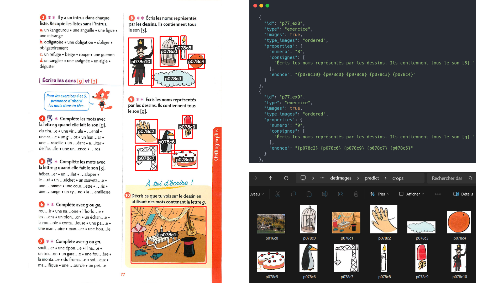

# 📘 MALIN-extraction-with-images

## 🚀 Description

Ce projet permet d’automatiser l’extraction d’exercices scolaires à partir de pages [images] du manuels scolaires.
Il utilise :

* **YOLO (Ultralytics)** pour détecter et localiser les zones d’images d'exercices.
* **OpenCV** pour rogner les zones détectées et annoter les pages avec des boîtes englobantes.
* **Google Gemini API** pour analyser et transformer les énoncés d’exercices en JSON/TSV structurés.

Le pipeline est orchestré par `main.py`, qui enchaîne automatiquement les étapes dans le bon ordre.

---

## 📂 Organisation du projet

```
MALIN-extraction-with-images/
│── main.py                     # Pipeline principal
│── detectImages.py              # Détection des zones (images) avec YOLO
│── cropImages.py                # Rognage et sauvegarde des zones détectées
│── drawBoxes.py                 # Dessin des boîtes (+ nom du crop) sur les pages
│── extraction-gemini-vision.py  # Appel à Gemini API pour analyser les exercices
│── prompt-vision.txt            # Prompt utilisé pour Gemini
│── apikey.txt                   # Clé API Gemini (à créer, non versionnée)
│── requirements.txt             # Dépendances Python
│
├── files/                       # Pages .png du manuel (input)
├── files_images/                # Pages annotées (boîtes + labels) : résultats
├── models/                      # Modèles YOLO (detImages.pt)
├── output/                      # Résultats YOLO et JSON intermédiaires
│   └── detImages/
│       └── predict/
│           ├── labels/          # Détections au format .txt
│           ├── crops/           # Images rognées
│           ├── *.json           # Détections converties en JSON
│           ├── *.jpg/png        # Copies des pages traitées
```

---

## ⚙️ Installation

1. **Cloner le projet**

   ```bash
   git clone <repo>
   cd MALIN-extraction-with-images
   ```

2. **Créer un environnement virtuel**

   ```bash
   python -m venv .venv
   .venv\Scripts\activate  # Windows
   source .venv/bin/activate  # Linux/Mac
   ```

3. **Installer les dépendances**

   ```bash
   pip install -r requirements.txt
   ```

4. **Télécharger le modèle YOLO** depuis [Google Drive](https://drive.google.com/drive/folders/1r4WGDN_AQkzw3PIK1GcmJcr4tXBWTKzC?usp=sharing)
   → puis à placer dans le dossier `/models/`.

5. **Configurer l’API Gemini**

   * Crée un fichier `apikey.txt` à la racine du projet.
   * Mets-y ta clé API **Google Gemini** (une seule ligne, sans guillemets).

   Exemple (`apikey.txt`) :

   ```
   AIzaSyXXXXXX-YYYYYYYY-ZZZZZZZ
   ```

6. **Ajouter les pages du manuel**
   Mets les pages au format `.png` dans `/files/`.

---

## 🔄 Pipeline (main.py)

Lorsque tu exécutes :

```bash
py main.py
```

Le script effectue les étapes suivantes :

1. **Réinitialisation des dossiers**

   * Supprime puis recrée `files_images/` et `output/` (pour éviter les conflits et fichiers précédents).

2. **Détection (detectImages.py)**

   * Charge le modèle YOLO `detImages.pt`.
   * Analyse chaque page dans `/files/`.
   * Génère :

     * des fichiers `.txt` (coordonnées des boîtes),
     * des `.json` (conversion LabelMe),
     * une copie des pages traitées dans `/output/detImages/predict/`.

3. **Rognage (cropImages.py)**

   * Lit les JSON générés.
   * Extrait les zones d’intérêt dans les pages originales (`/files/`).
   * Sauvegarde chaque crop dans `/output/detImages/predict/crops/`.
   * Format de nommage : `p{numPage}c{id}.png`.

4. **Annotation (drawBoxes.py)**

   * Ajoute sur les pages `/files/` des boîtes englobantes rouges.
   * Écrit au centre de chaque boîte l’identifiant du crop (ex. : `p16c0`).
   * Sauvegarde les pages annotées dans `/files_images/`.

5. **Extraction avec Gemini (extraction-gemini-vision.py)**

   * Charge le prompt `prompt-vision.txt`.
   * Pour chaque image annotée dans `/files_images/` :

     * Appelle l’API Gemini avec l’image.
     * Sauvegarde un résultat en `.json` et `.tsv`.
   * Dans les énoncés, les images sont référencées par leur identifiant (ex. : `{p16c0}` → correspond à `/output/detImages/predict/crops/p16c0.png`).

---

## 📸 Règles sur les images

* **Aucune image** → `"images": false`, `"type_images": "none"`.
* **Une seule image** → `"images": true`, `"type_images": "unique"`.
* **Plusieurs images** → `"images": true`, `"type_images": "ordered"`, `"unordered"` ou `"composite"`.
* Les images sont **toujours contenues dans une boîte rouge**, et leur **nom est écrit au centre en texte blanc sur fond noir**.
* Lorsqu’une image est présente, insérer son **nom de fichier (sans extension)** dans l’énoncé entre `{ }`.

  * Exemple :

    ```
    a. {p130c2} {p130c3}, b. {p130c0} {p130c1}
    ```

---

## 📝 Exemple d’utilisation



---

## 🔑 Points importants

* Les **images originales** doivent être dans `/files/` et au format `.png`.
* Les **crops** sont nommés automatiquement : `p{numPage}c{id}`.
* Les **énoncés contenant {pXXcY}** sont liés directement aux images rognées correspondantes.
* La clé API **Gemini** doit être stockée dans `apikey.txt` (jamais dans le code source).

---

